## Burn

推荐使用 u-disk 进行固件烧录。

### u-disk


进入 U 盘下载模式：

* 板子未通电：在按住两侧键的同时用数据线将电脑与开发板的 OTG 口连接。

* 板子通电时：数据线已将电脑与开发板的 OTG 口连接时，按住两侧键，再按下 RST 键，松开 RST 键，松开两侧键。

进入 U 盘烧录模式后，在电脑上会显示个小容量磁盘，把固件拖拽进去，数秒后板子会重启，U 盘被弹出，表示烧录完成。


### uart

**烧录工具**：[Bouffalo Lab Dev Cube](https://dev.bouffalolab.com/download)

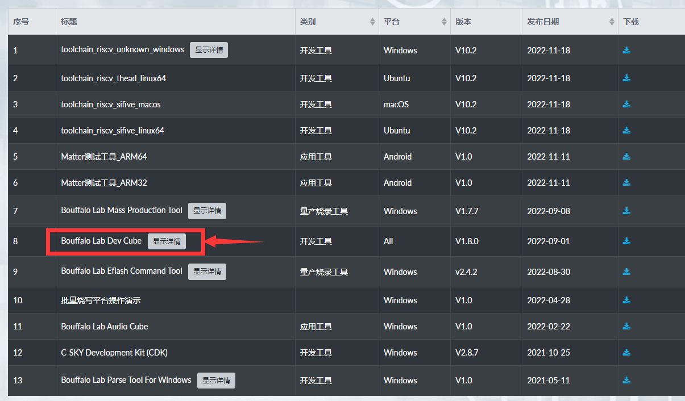

解压后文件中的三个文件 `BLDevCube.exe`、 `BLDevCube-macos` 和 `BLDevCube-ubuntu` ，用于不同的操作系统。

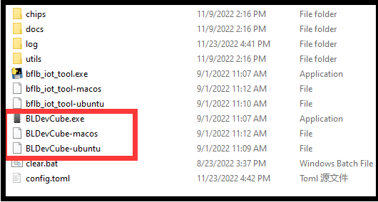

**固件烧录**

①

使用数据线连接开发板的 UART 口，此时电脑上会出现两个串口。

---

如果出现鼠标不能动的现象，拔掉 USB 并按以下方式更新**板载 bl702 固件**。

烧录工具 `BLDevCube`， `MCU` 模式，目标芯片 `BL702`，固件 `usb2dualuart_bl702_221118.bin`。

在上电前按住 BOOT 键（必须的），使用数据线连接 UART 口，点击 `Refresh` 按钮，选择 `唯一` 的串口，设置波特率为 2M，点击烧录按钮，烧录完成后，重新插拔数据线。

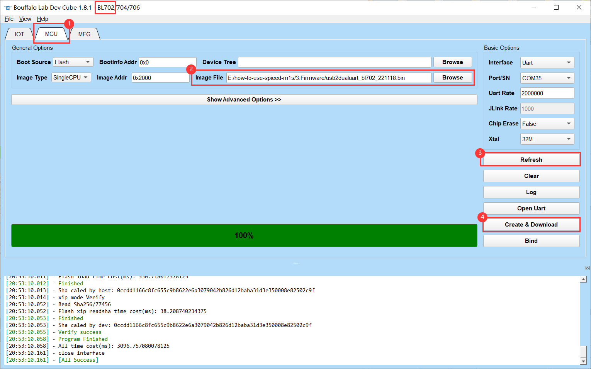

---

②

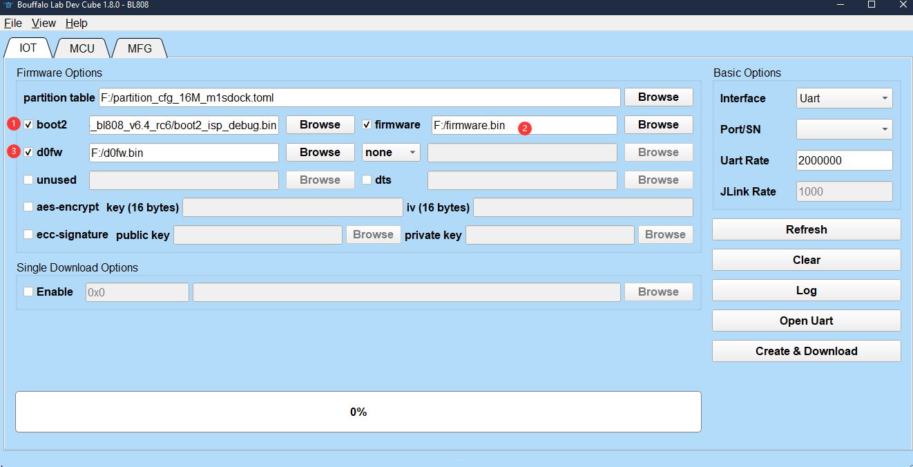


烧录工具 `BLDevCube`， `IOT` 模式，目标芯片 `BL808`。

- `partition`：分区表，`partition_cfg_16M_m1sdock.toml`。
- `boot2` ：`/BouffaloLabDevCube/chips/bl808/builtin_imgs/boot2_isp_bl808/boot2_isp_debug.bin` 。
- `firmware`：E907 核心运行的固件。
- `d0fw`：C906 核心运行的固件，U 盘烧录就是给此核心烧录的。

首次烧录 `firmware` 和 `boot2` 都需要勾选，之后按需烧录而不用全部勾选。

③

选择串口号较大的串口，波特率设置为 `2M`。

按住开发板上的 BOOT 键和 RST 键， 先松开 RST 键后松开 BOOT 键来以进入串口烧录模式。

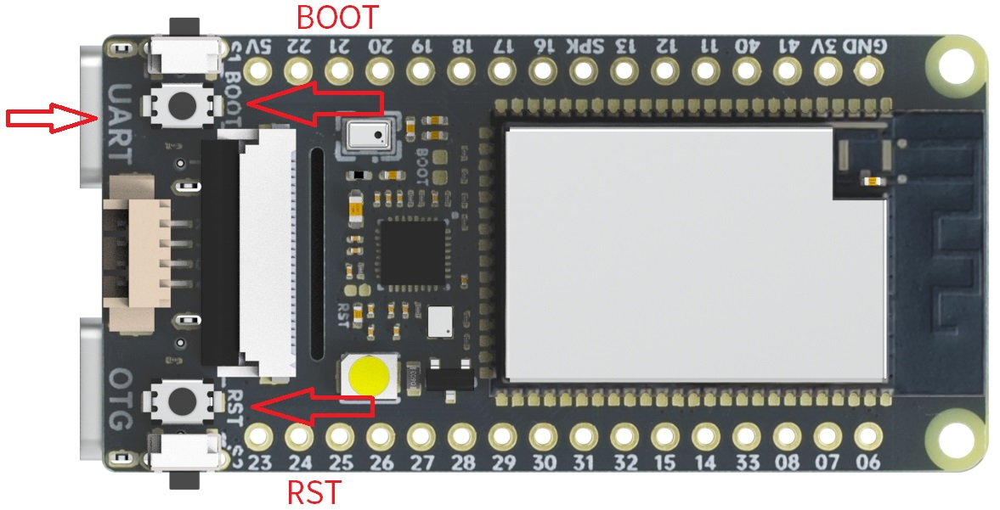

最后点击烧录 `Create & Download` 按钮即可。

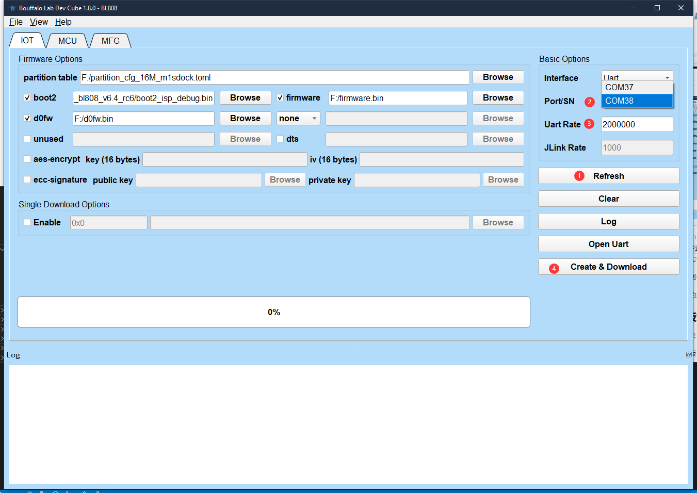

## [Fireware](https://dl.sipeed.com/shareURL/MAIX/M1s/M1s_Dock/7_Firmware)

### factory

出厂默认固件：d0fw_20221212.bin & firmware_20221212.bin，可由 [M1s_BL808_example](https://gitee.com/sipeed/M1s_BL808_example) 编译得。

在上电后，屏幕会显示摄像头所拍摄到的内容，且按两侧的按键显示屏上的数字会有变化，那个数字表示着 LED 的亮度。

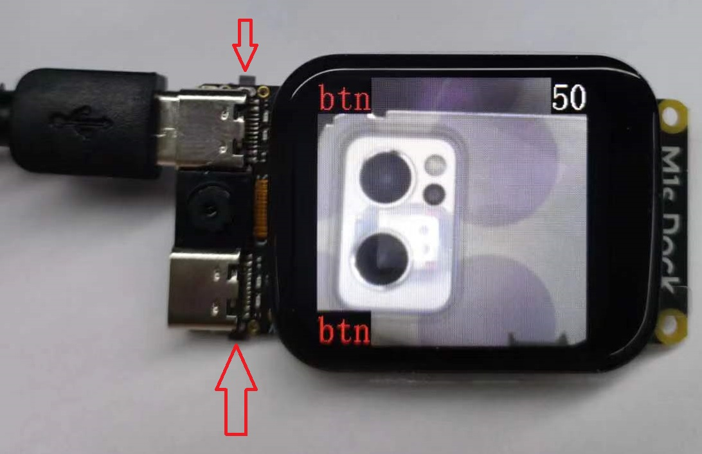

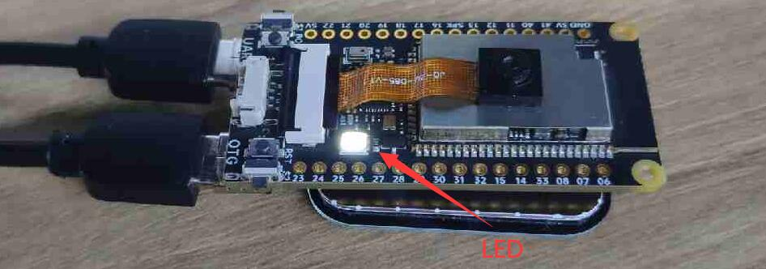

通过 OTG 口连接 PC 的话会有一个大小为 3M 的 U 盘（如没出现，需重刷 BL702 固件）


通过 UART 口连接 PC 会显示有两个串口设备

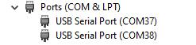

设置波特率为 2000000，分别打开两个串口，会看到不同的信息。

打开小号串口可以看到一直在打印信息：

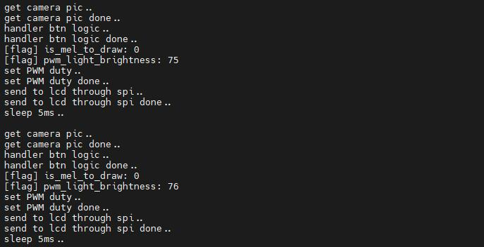

打开大号串口可以进行命令行交互：

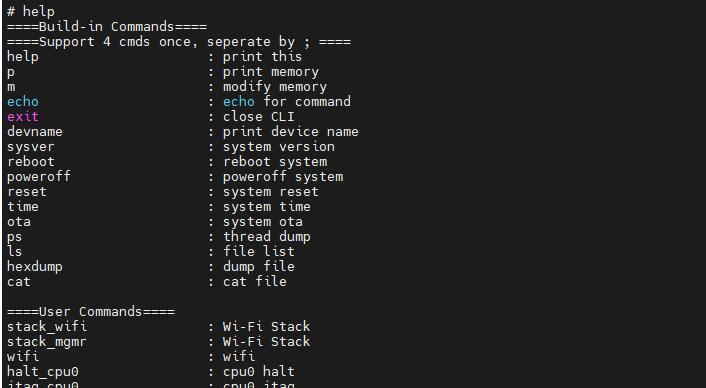

### spi_lcd

全屏填充颜色。

### lvgl

（我跑的，感觉画面有点撕裂）

[LVGL](https://lvgl.io/) (轻巧而多功能的图形库)是一个免费的开放源代码图形库，适合用于 mcu 构建图形界面。

烧录进 M1s Dock 后，屏幕显示着 lvgl 测试效果，设置波特率为 2000000，串口号较小的串口打印着最后一次触摸屏幕位置。

| 测试效果                                        | 串口输出                                        |
| ----------------------------------------------- | ----------------------------------------------- |
| 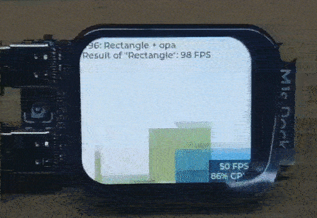 | 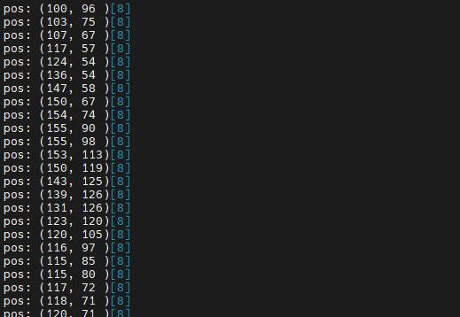 |

### image_processing

一个简单的图像处理例子。

烧录进 M1s Dock 后，屏幕上显示摄像头画面，按下两侧的按键可以切换不同的图像算子。设置波特率为 2000000，串口号较小的串口显示着上次按键和其他信息。

| 测试效果                                                     | 串口输出                                                     |
| ------------------------------------------------------------ | ------------------------------------------------------------ |
| 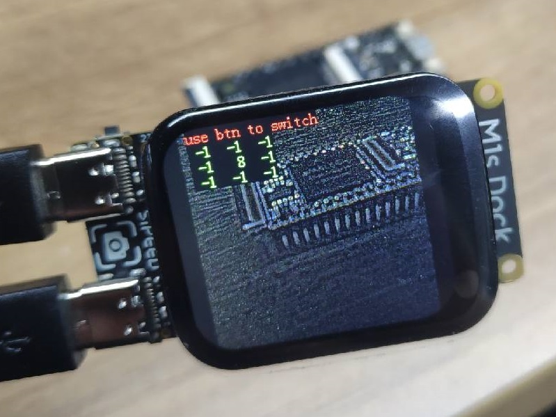 | 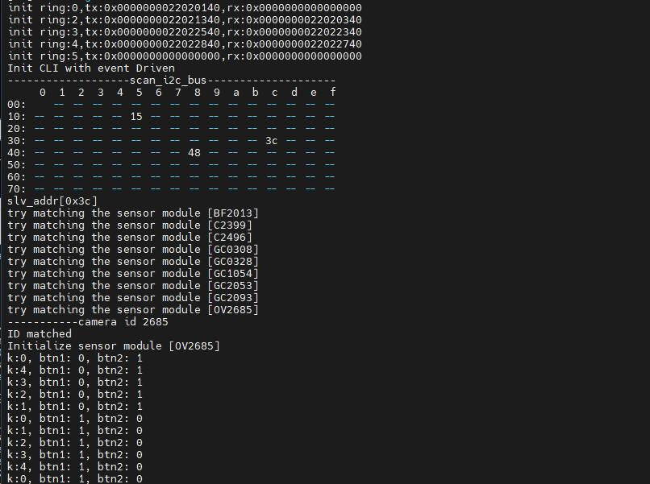 |

### tinymaix_mnist

[TinyMaix](https://github.com/sipeed/TinyMaix) 是面向单片机的超轻量级的神经网络推理库，即 TinyML 推理库，可以在任意单片机上运行轻量级深度学习模型。

烧录进 M1s Dock 后，屏幕中间的红框识别数字。设置波特率为 2000000，串口号较小的串口打印着识别信息。

| 测试效果                                                     | 串口输出                                                     |
| ------------------------------------------------------------ | ------------------------------------------------------------ |
| 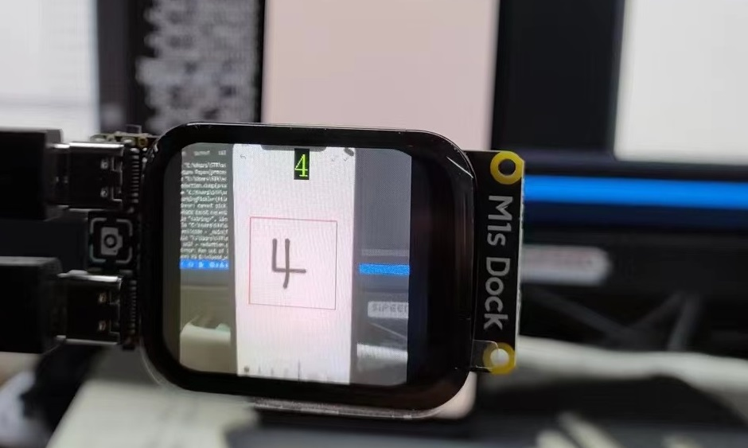 | 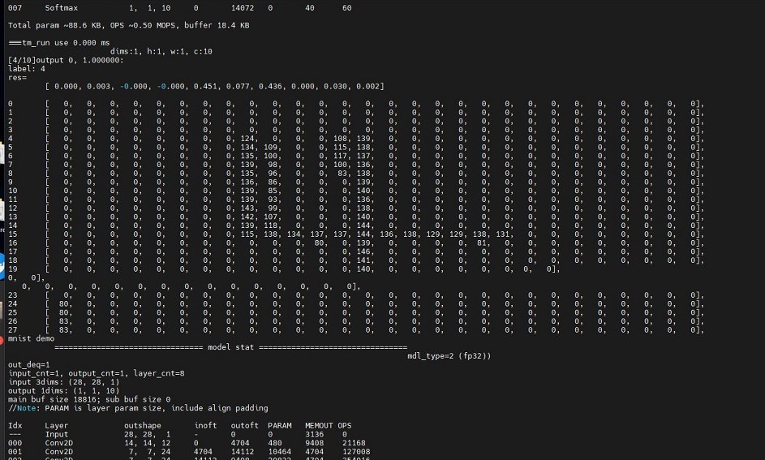 |

### pikascript

[PikaScript](http://pikascript.com/) 是一个跨平台的超轻量级嵌入式 Python 引擎。

烧录进 M1s Dock 后，屏幕白屏，无内容。设置波特率为 2000000，打开串口号较小的串口来进行命令行交互。

在命令行中输入这些指令：

```python
arc = lv.arc(lv.scr_act())
arc.set_end_angle(200)
arc.set_size(150, 150)
arc.center()
```

测试效果：

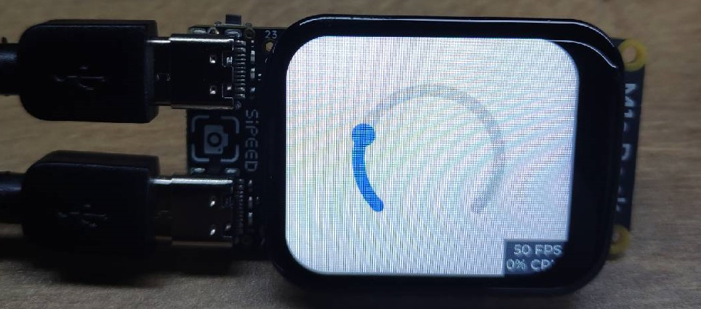

### blai_mnist

MNIST 手写数字识别（我的没跑通，报内存不够）

烧录，按复位键，串口号较小提示加载模型失败。

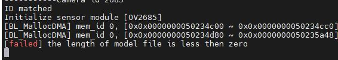

连接 OTG 口，出现 U 盘。

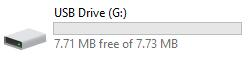

把模型 `mnist.blai` 放到  `models` 文件夹中。

```
models
└── mnist.blai
```

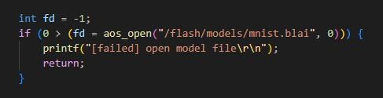

复位，串口输出，屏幕显示摄像头捕获到的画面，和识别结果。

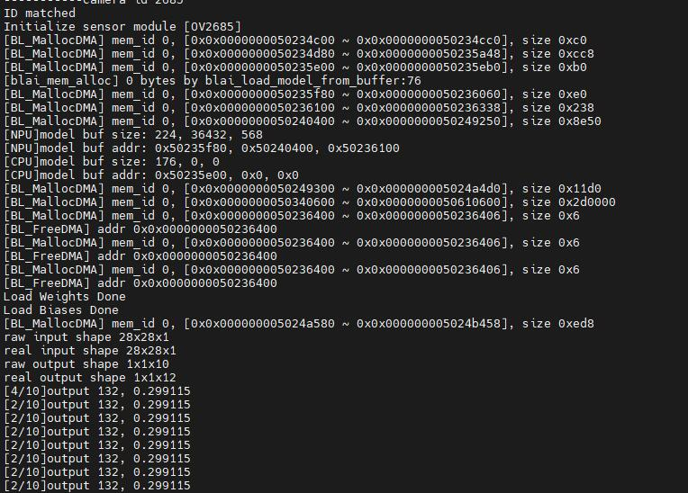

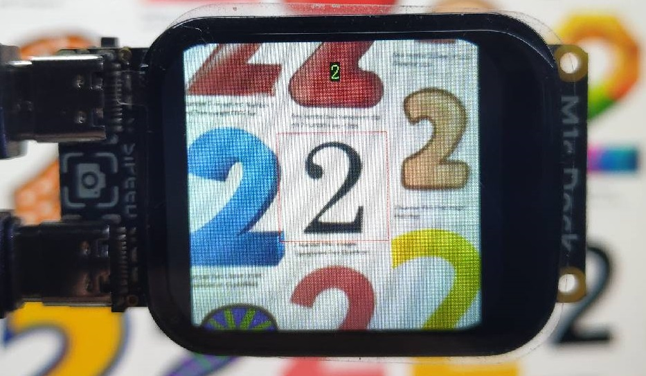

### ChipKey

用于获取机器码。在 [MaixHub](https://maixhub.com/) 下载模型需要机器码（每个板子都不同）：

```
E32DF49285230CB41DCDFC881553AD368649CDC792D63AC56B17CD2311A81E3D
```

选择较大的串口号，波特率设置为 2000000（2M），按下 RST，查看串口信息即可。

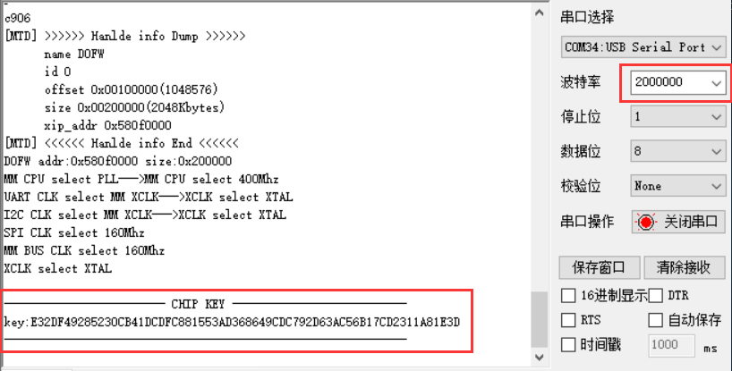

如没有输出使用串口烧录工具更新固件： `firmware_m1sdock_221109.bin` / `firmware_20221212.bin`。